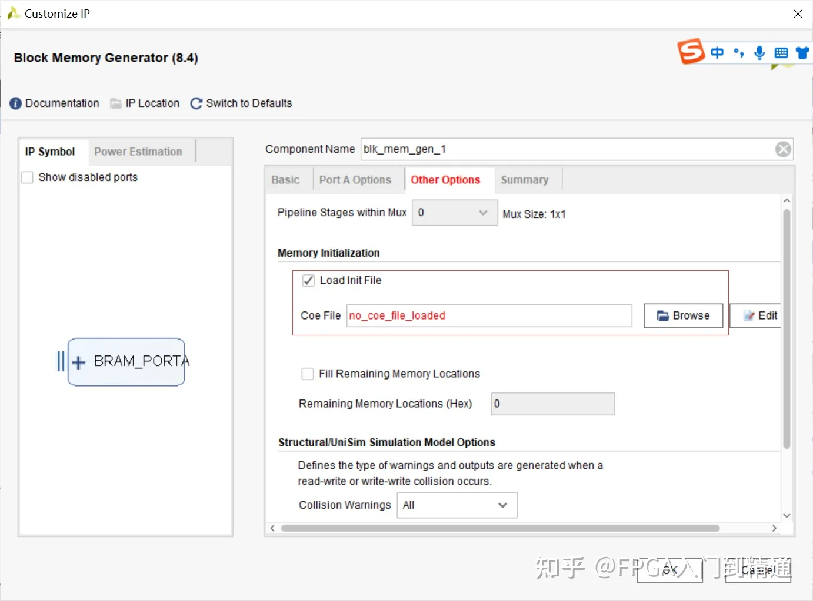
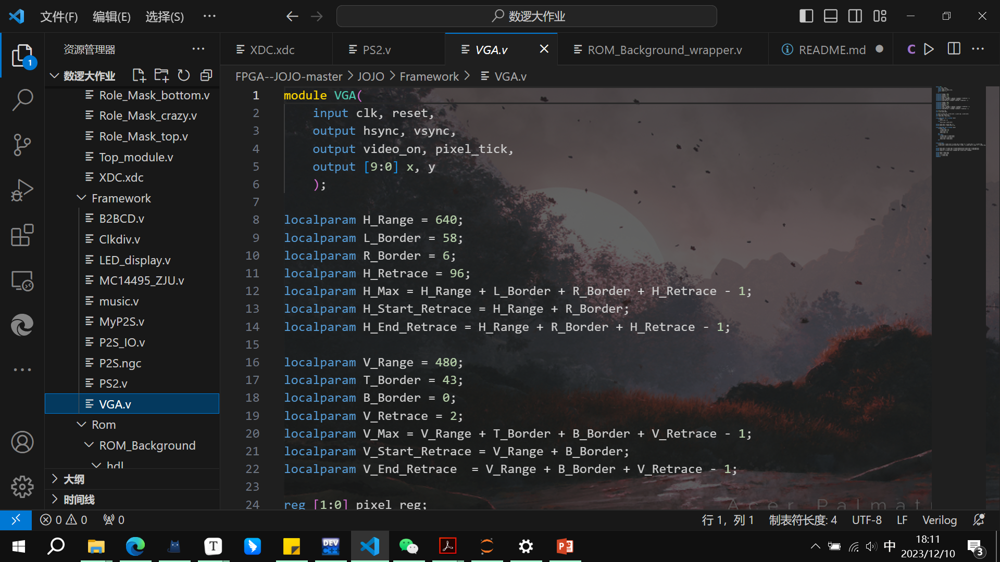
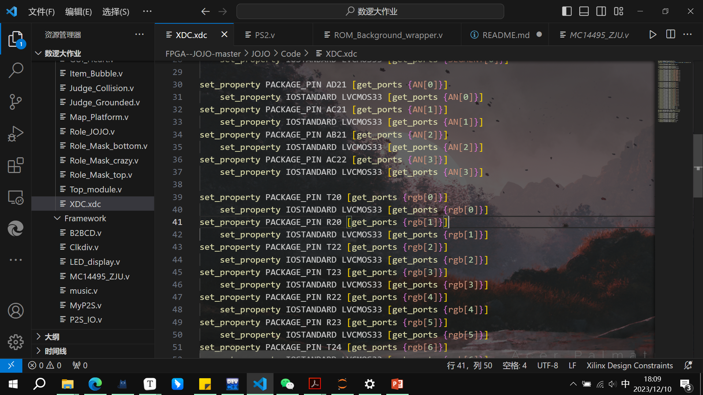

# 数逻大作业

DDL： 1 月 11 日 23:59

参考JOJO的优秀作品

1. 编程语言为verilog，需要实现一个FSM，**有时序逻辑**的电路，迷宫逻辑核心相当于CPU，处理各种逻辑

2. verilog vivado ：sythesize & implement -> write bitstream -> program target

   FPGA板子控制VGA屏幕生成图像、声音

   

   3. 有逻辑交互，主要靠PS/2接口

## 可以直接套用的东西：

现成的约束文件`constraints_final_proj.xdc`（约束了rgb才能显示彩色）

framework模块，包括PS2键鼠接口，VGA显示接口，声音模块接口

rom process:可见是用plt库将png图片转化成了coe（初始化存储器内容的文件格式Cotent Editor),可以套用

```c
import wave
import pylab as pl
import numpy as np
```

甚至声音转化为txt note格式也是现成的：

```c
0: note <= 8'd0;
1: note <= 8'd11;
2: note <= 8'd12;
3: note <= 8'd11;
4: note <= 8'd10;
5: note <= 8'd11;
6: note <= 8'd11;
7: note <= 8'd9;
8: note <= 8'd7; ........
```

png转coe文件过程：

```c
from PIL import Image
import numpy as np
import matplotlib.pyplot as plt

img = Image.open("background.png")
pix = img.load()
width = img.size[0]
height = img.size[1]
f = open("background.coe", "w")
f.write("memory_initialization_radix = 2;\n")
f.write("memory_initialization_vector = \n")

for y in range(height):
    for x in range(width):
        r, g, b = pix[x, y]
        r_ok = r>>4
        g_ok = g>>4
        b_ok = b>>4
        f.write("%s%s%s,\n"%('{:04b}'.format(r_ok), '{:04b}'.format(g_ok), '{:04b}'.format(b_ok),))
```


```verilog
module ROM_music(
	input clk,
	input [7:0] address,
	output reg [7:0] note
);
```

## 需要自己实现的部分：

为降低查重，增加贡献，也可以考虑使用matlab等以另外的方式生成coe，不一定要参考JOJO

```c
//比如做一个迷宫，文件结构
-maze
	code top_module.v， fsm等
    framework 各个模块
    Rom 在coe文件生成完之后vivado里面生成的ip core
-Rom process
```


1. 

2. rom process: ROM即只读寄存器，png/mp3 格式包含了大量信息，可将其转化为coe文件，烧录到ROM的寄存器阵列里面，使用vivado自定义ROM的寄存器格式

   gpt：

   ```c
   使用 ROM IP 核，您可以将 COE 文件中的数据加载到 FPGA 中的只读存储器中，然后通过 IP 核提供的接口进行访问。这样可以大大简化设计，并且可以提高性能，特别是对于大量初始化数据的情况。
   因此，自定义 ROM 的 IP 核是一种可以将 COE 文件中的数据快速加载到 FPGA 中的只读存储器中，并提供高效访问的硬件 IP 核。这种 IP 核可以帮助简化设计，并提高性能。
   ```

coe文件的格式：

 The Block Memory Generator的核心使用coe文件或vivado默认的形式进行初始化

.coe文件能填充内存中每一块位置。coe文件中有两个参数：

```c
memory_initialization_radix（存储数值的基数，就是进制数）: 只能选2，10，16进制
memory_initialization_vector（存储的数值）: 定义其中存储的数值
```

示例：

```c
memory_initialization_radix = 2;
memory_initialization_vector = 
111111110000,
111111110000,
111111110000,
111111110000,
111111110000,
100000110010,
100100110010,
101000110011,......
```

## 生成coe文件后自定义IP核生成

IP核？FPGA 的 IP 核指的是知识产权核心（Intellectual Property core），它是一种可在 FPGA（现场可编程门阵列）中使用的预设计的可重用功能模块。这些 IP 核可以是数字信号处理器、通信接口、存储控制器、处理器核心等各种功能块。

IP 核允许设计者将已验证的功能模块直接集成到其 FPGA 设计中，从而加快设计时间、降低风险，并提高系统性能。这些 IP 核通常由 FPGA 厂商或第三方供应商提供，用户可以购买或获取许可，以便在他们的 FPGA 设计中使用这些功能模块。

生成自定义的 COE 文件后，您可能需要自定义 ROM 的 IP 核，这是因为 ROM IP 核可以提供对 COE 文件中数据的快速访问，而无需在 FPGA 中使用大量的逻辑资源来实现类似的功能。

ROM IP 核是一种硬件 IP 核，通常由 FPGA 厂商或第三方供应商提供。它允许您在 FPGA 中实现只读存储器（ROM），并且可以在设计中直接使用 COE 文件中的数据。这种 IP 核可以提供快速、高效的数据存储和检索功能，而无需手动实现大量逻辑来模拟 ROM 行为。

使用 ROM IP 核，您可以将 COE 文件中的数据加载到 FPGA 中的只读存储器中，然后通过 IP 核提供的接口进行访问。这样可以大大简化设计，并且可以提高性能，特别是对于大量初始化数据的情况。

因此，自定义 ROM 的 IP 核是一种可以将 COE 文件中的数据快速加载到 FPGA 中的只读存储器中，并提供高效访问的硬件 IP 核。这种 IP 核可以帮助简化设计，并提高性能。

[COE文件与MIF文件使用方法 - 知乎 (zhihu.com)](https://zhuanlan.zhihu.com/p/620570882)

在Vivado中，需要将COE文件添加到项目中，然后将其设置为存储器IP核“BRAM”的初始化文件，加载界面如下：



MIF 指的是 Memory Initialization File（内存初始化文件），它是一种常见的用于描述存储器初始化内容的文件格式。MIF 文件通常用于 FPGA 设计中，特别是在初始化存储器时。

MIF 文件包含了存储器的初始化数据，通常是以十六进制或二进制格式表示。这些文件描述了存储器中每个地址的初始值，以及存储器的宽度、深度等信息。

在 FPGA 设计中，MIF 文件经常用于初始化存储器，比如初始化存储器中的 BRAM（块RAM）或者其他类型的存储器。这些初始化文件可以通过 MIF 文件中指定的数据来配置存储器的初始状态，以便在 FPGA 启动时加载这些数据。


VGA接口：




